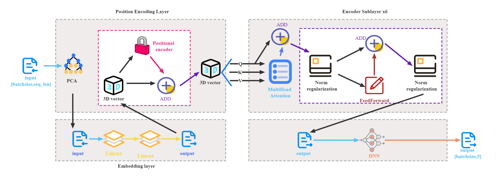

# [Transformer Model with Multi-Type Classification Decisions for Intrusion Attack Detection of Track Traffic and Vehicle]([https://example.com](https://ieeexplore.ieee.org/abstract/document/10447002))[](https://doi.org/10.1109/ICASSP48485.2024.10447002)





This is the official implementation for our paper **Transformer Model with Multi-Type Classification Decisions for Intrusion Attack Detection of Track Traffic and Vehicle**, accepted by **ICASSP'24**. The **PTIDS model** presented in this paper consists of two main components: a **data preprocessing module** and an **intrusion detection module**. The **preprocessing module** utilizes the **PCA decision tree algorithm** to extract relevant feature data, while the **intrusion detection module** integrates **Transformer's encoder layer** with a **DNN neural network**. Figure illustrates the structural configuration of the **PTIDS model**.


## Requirements

The experimental operating system is Windows 10 64-bit, with 16GB of RAM, Intel i5-9300h 2.4GHz CPU, and NVIDIA GTX1650 4GB GPU.

The compilation language is Python 3.8, with PyTorch 1.12.0 as the experimental framework, and PyCharm 2021.1 (Professional Edition) as the compilation software.

## Datasets

Download the three public datasets we use in the paper at:

The datasets are stored in the `totaldata` directory. The `carhack` directory contains the source data used for training models:

- `dos_dataset.csv`, `fuzzy`, `gear`, `normal_run`, and `RPM` are the original datasets.
- `totalid_data.csv` is the preprocessed dataset used for training the `td` and `tp` models.
- `newtotalid_data.csv` is the preprocessed dataset used for training the `PTD` model.
- `train_data`, `val_data`, and `test_data` correspond to the training, validation, and test datasets, respectively.

Under the `data1` directory are datasets split for training, testing, and validation after training TD and TP models.

The B-can and M-CAN Intrusion datasets are located in their respective directories, following the same naming conventions as above.

Links to the source data:
- [Car Hacking Dataset](https://ocslab.hksecurity.net/Datasets/car-hacking-dataset)
- [B-CAN Intrusion Dataset](https://ocslab.hksecurity.net/Datasets/b-can-intrusion-dataset)
- [M-CAN Intrusion Dataset](https://ocslab.hksecurity.net/Datasets/m-can-intrusion-dataset)

Preprocess the dataset using pyKT to obtain the student's mastery level of knowledge concepts (MLKC), the probability of knowledge concepts appearing in the next exercise (PKC), and the forgetting rate of knowledge concepts (FRKC).

We provide an example of a CSV file obtained after pyKT processing using the Algebra 2005 dataset (top 10 rows), located in `KG4Ex/pyKT_example/Algebra2005_head_10.csv`.

## Project Structure


  - `transformer/`: Contains project code.
    - `BP.py`, `CNN.py`, `DNN.py`, `KNN.py`, `transformer.py`, `tree.py`, `SVM.py`: Specific code for designed neural network models.
    - `model.py`: Code for training, validating, and testing models. Implements the connection and training of transformer with DNN and BP.
    - `dnnbptest.py`: Code for training DNN and BP models.
    - `getdata.py`: Code for data preprocessing.
    - `draw.py`: Code for plotting functions related to various metrics during training.
    - `config.py`: Parameters for training models.
  - `mymodel/`: Trained TD and TP models.
  - `mymodel2/`: Trained PTD models.


## Citation

If you find our work helpful, please kindly cite our research paper:


```bibtex
@inproceedings{10447002,
  author={Guan, Quanlong and Zhang, Tian and Qin, Yu and Zhou, Yuyu and Zhu, Yangguang and Zhong, Yuansheng and Huang, Xiujie and Duan, Zhifei and Li, Zhefu and Liu, Changjiang and Wu, Xiaofeng},
  booktitle={ICASSP 2024 - 2024 IEEE International Conference on Acoustics, Speech and Signal Processing (ICASSP)}, 
  title={Transformer Model with Multi-Type Classification Decisions for Intrusion Attack Detection of Track Traffic and Vehicle}, 
  year={2024},
  volume={},
  number={},
  pages={4510-4514},
  keywords={Dimensionality reduction;Neural networks;Intrusion detection;Signal processing;Transformers;Data models;Security;Vehicle intrusion detection;Temporal attributes;Transformer;Multi-head Self-attention;Track traffic},
  doi={10.1109/ICASSP48485.2024.10447002}
}


